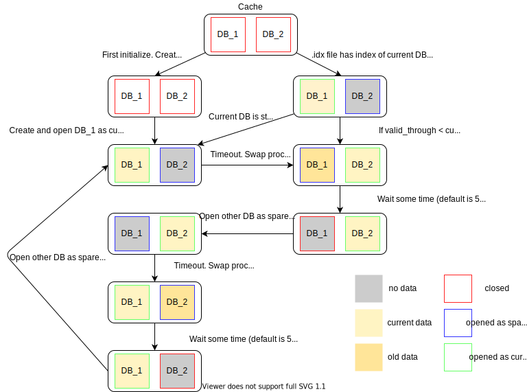

# ScheduledCache

Scheduled Cache is a cache storage based on RocksDB with TTL of tables. Interval
of clearing depends on the crontab-like schedule string.

# How ScheduledCache works

Cache consists of two DBs. One (current) DB processes all API requests and second DB is a spare.
Each time when schedule timer is triggered current DB swaps with the spare.
After 5 seconds (the value could be changed) first DB is cleared and becomes new spare.

# Configuration

ScheduledCache is configured with options map that has following parameters.

Required:

* `name :: atom`: unique name of the cache
* `schedule :: cron-like string`: сron expression sets clearing interval. Could be generated [here](https://crontab.guru)

Optional:

* `expired_cache_ttl :: pos_integer`:  Time to live of DB after swap procedure. Default: 5000 ms
* `db_path :: String.t`: custom cache path. Default: `"./#{name}"`
* `db_opts :: list`: list of RocksDB options. See all available options [here](https://github.com/facebook/rocksdb/blob/master/include/rocksdb/options.h). Default: `[create_if_missing: true]`
